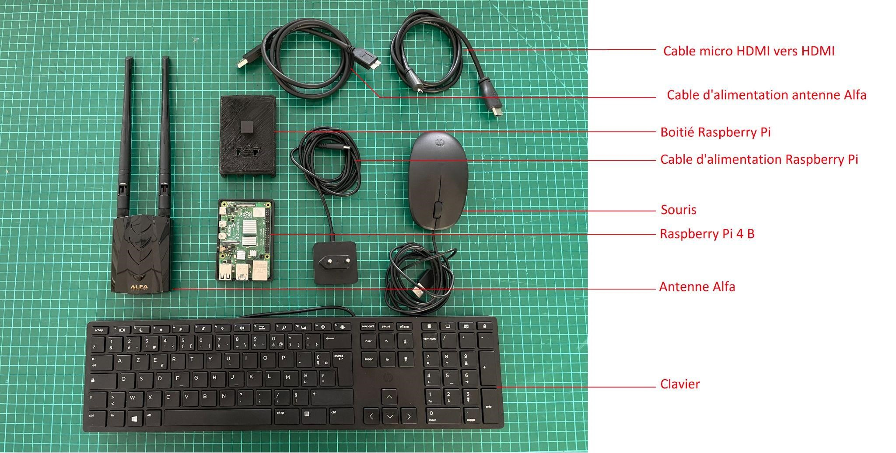

<p align="center"></p>

------

<h2>Présentation</h2>
Un outil de sensibilisation aux attaques wifi, facilement réutilisable pour un néophyte en informatique. Cet outils va mettre en place des scénarios d'attaque avec des wifis malveillant. Le projet a été développé sur une Raspberry 4B+. 

<br>
<p align="center"></p>
<h2>Scénarios</h2>

| Nom du Scénario       | Description   | 
| --------------------- |-------------  |
| Wifi Malveillant      | Mettra en place un point d\'accès wifi sans restrictions où vous pourrez récupérer les trames réseaux (exploitables sur Wireshark). |
| Portail Captif        | Mettra en place un wifi malveillant avec soit : v1 Comportement d'un portail captif normal , v2 Refus des premieres entrées utilisateur, v3 verification sur le portail captif légitime.   |
| Attaque KARMA         | Se fait passer pour le point d'accès le plus demandé par les probe request.       | 
| DNS Spoofing          | Mettra en place un point d\'accès wifi sans restrictions, cependant lorsque les clients du wifi accèderont à une page en HTTP, une fausse page de connexion Google s\'affichera pour qu\'ils se connectent. Vous allez récupérer: \n- les identifiants saisis sur la page Google\n- les trames réseaux (exploitables sur Wireshark).'           |       

<h2>Installation</h2>

```bash
    sudo apt-get update && sudo apt upgrade -y 
    sudo apt install network-manager -y 
    sudo reboot

    cd Fake_Access_Point/
    sudo ./installation.sh
```

<h2>Lancement<h2>
<h3>Interface Grahique</h3>

```python
    python3 graphic.py
```

<h3>Ligne de Commande</h3>

```bash 
    sudo ./setup.sh
```

<h2>Stop</h2>

```bash 
    sudo ./stop.sh
```
